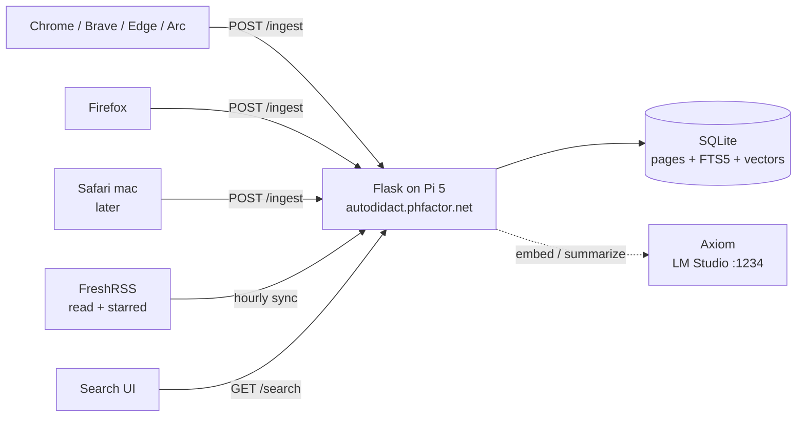

# Autodidact Architecture

Exported 2026-09-18 from the "Autodidact Architecture" Claude doc (originally written 2026-09-16). This file is now the source of truth; edit it here.

## Goal

Autodidact records the text of every web page Paul dwells on, in every browser he uses, and finds it again months later from a vague description. The core loop is: capture on dwell, store extracted text locally, search by keyword, meaning, and approximate date.

Success looks like this: type "that blog post about SQLite write-ahead logging I read sometime in the spring, maybe on a personal site" and get the right page in the top five. No cloud services; everything runs on the home network (the Pi 5 webserver for storage and search, Axiom for embeddings and summarization).

Non-goals for v1: full-fidelity page archiving, annotation or highlighting, syncing across machines, and anything on iOS. Those come later or not at all.

## Architecture overview

Two sources feed one server: browser extensions capture what you dwell on, and an hourly sync pulls what you read or starred in FreshRSS on any client, phone included. The extension is deliberately dumb; all policy beyond a domain blocklist lives server-side so it can change without redeploying to five browsers.



Each source sends one JSON document per item: URL, title, extracted text, timestamps, and for browser captures the dwell time. The server dedups on URL and content hash, so an article read in the RSS client on the phone and opened on the laptop later is one page with two visits. FTS5 is updated synchronously; embedding and summarization are a background job that calls Axiom's OpenAI-compatible endpoint, so ingest never blocks on the Mac Studio being awake.

## Capture: the browser extension

One Manifest V3 codebase runs unchanged on every Chromium browser and, with a two-key manifest difference, on Firefox. It captures a page only after Paul has dwelled on it, not on load.

**When it fires.** A content script starts a timer on load and on every SPA navigation. After 8 seconds of the tab being visible and focused, it captures. Time spent with the tab hidden does not count. A second capture of the same URL in the same tab only happens if the content hash changed, which handles infinite-scroll and SPA pages. (Implementation note: the design said to wrap `history.pushState`; that does not work from a content script's isolated world, so the shipped code polls `location.href` once a second instead.)

**What it extracts.** A Readability-style pass: strip `script`, `style`, `nav`, `header`, `footer`, `aside`, and hidden elements, then take the text of the largest content block, falling back to `body`. It sends the title, the canonical URL if the page declares one, the first `meta[name=description]`, the extracted text (capped at 200 KB), the language, and dwell time so far. No HTML, no screenshots in v1.

**What it skips.** Incognito and private windows (the extension is not enabled for them by default and refuses anyway). Any URL on the blocklist, which is a user-editable list in the options page seeded with mail, banking, password managers, and localhost. Any page whose extracted text is under 200 characters, which drops login pages, redirects, and blank tabs. `chrome://`, `about:`, `file://`, and extension pages.

**Transport.** The content script messages the background service worker, which POSTs to the server with a shared bearer token stored in extension storage. Failed posts are queued in `chrome.storage.local` and retried on a one-minute alarm, so the Pi being down loses nothing. Dwell time is reported by a 15-second heartbeat while the page stays open, because messages sent from `pagehide` are unreliable in MV3.

## Second source: FreshRSS

Reading in an RSS client on the phone never touches a browser, but every client syncs read and starred state back to FreshRSS, and FreshRSS exposes that through its Google Reader compatible API. `freshrss_sync.py` runs hourly on the Pi and asks for items that are read (reading-list minus unread) and items that are starred.

**What it sends.** The feed's HTML converted to text; when a feed only carries an excerpt (under 700 characters) it fetches the article URL and extracts the body with trafilatura, falling back to the page's `article` or `main` block. Items land with `source = rss`, the feed title, and the publish date, and starred items carry the word "starred" so they are findable by that alone. The server's dedup and search treat them like any other page.

**Read time is approximate.** FreshRSS records that you read something, not when; the sync time stands in, so with an hourly run the seen date is right to within an hour for anything read since the last run and right to the day for the rest.

**Caveat: mark-all-as-read.** FreshRSS cannot tell an article you opened from one swept away by mark-all-read. `--mode starred` restricts the sync to what you deliberately kept; the default `--mode both` trusts read state. Which corpus searches better is an open question to settle after a few weeks of both.

## Ingest and storage

A Flask app with a single SQLite file, FTS5 for text, and a separate visits table so one page seen forty times is one row plus forty visits. At 30 KB of text per page and 100 pages a day, a year is roughly 1 GB, well within a Pi's SD card.

The authoritative schema is `server/db.py`; the design-time version was:

```sql
CREATE TABLE pages (
  id            INTEGER PRIMARY KEY,
  url           TEXT NOT NULL,
  url_hash      TEXT NOT NULL,          -- sha256(normalized url)
  content_hash  TEXT NOT NULL,          -- sha256(text)
  title         TEXT,
  description   TEXT,
  text          TEXT NOT NULL,
  lang          TEXT,
  domain        TEXT NOT NULL,
  first_seen    INTEGER NOT NULL,       -- unix seconds
  last_seen     INTEGER NOT NULL,
  visit_count   INTEGER NOT NULL DEFAULT 1,
  total_dwell_s INTEGER NOT NULL DEFAULT 0,
  summary       TEXT,                   -- filled by background job
  tags          TEXT,                   -- JSON array, background job
  UNIQUE(url_hash, content_hash)
);
CREATE TABLE visits (
  id       INTEGER PRIMARY KEY,
  page_id  INTEGER NOT NULL REFERENCES pages(id),
  seen_at  INTEGER NOT NULL,
  dwell_s  INTEGER NOT NULL,
  browser  TEXT
);
CREATE VIRTUAL TABLE pages_fts USING fts5(
  title, description, text, summary, tags, domain,
  content='pages', content_rowid='id', tokenize='porter unicode61'
);
CREATE TABLE embeddings (
  page_id INTEGER PRIMARY KEY REFERENCES pages(id),
  model   TEXT NOT NULL,
  vector  BLOB NOT NULL                 -- float32 array
);
```

Shipped additions: `pages.source` (`web`|`rss`), `pages.feed`, `pages.published_at` (applied by `MIGRATIONS` on open); `visits.visit_id` (client-generated, UNIQUE, for dwell upserts); `embeddings.dim`; `ON DELETE CASCADE`; indexes on source, url_hash, last_seen, domain.

**Dedup rule.** URL normalization strips fragments, `utm_*` and similar tracking parameters, `www.`, default ports, and trailing slashes, and sorts the query string. If the URL hash and content hash both match an existing row, only `last_seen`, `visit_count`, and `total_dwell_s` change and a visit is appended. Same URL with new content (an edited article, a feed page) becomes a new row; the old one stays so the old content is still findable.

**Endpoints.** `POST /ingest` takes the source's JSON and a bearer token, returns the page id. `POST /dwell` upserts a visit's dwell time. `GET /search` takes `q`, optional `after` and `before` dates, optional `domain` and `source`, and returns ranked hits with snippets; empty `q` lists the most recent pages. `GET /page/<id>` returns the stored text (JSON, or HTML with `?format=html`). `DELETE /page/<id>` and `DELETE /domain/<d>` remove mistakes. `GET /stats` for counts (including by source). `GET /` is the search UI. FTS triggers keep `pages_fts` in sync on insert, update and delete; the vector table is filled by `embed.py`, a cron job that batches unembedded rows to Axiom.

## Search

Three layers, each cheap to add on top of the last, with time as a filter on all of them. Layer 1 ships in v1; layers 2 and 3 are where vague queries start working.

| Layer | What it matches | How | Cost |
|---|---|---|---|
| 1. Keyword | Words that appear in the page, title, or domain | FTS5 BM25, title/summary/tags columns weighted 3× | Free, sub-10 ms on the Pi |
| 2. Semantic | Meaning, when your words are not the page's words | Embed query and pages with a small local model on Axiom; cosine over a numpy matrix loaded in memory | ~50 ms per query, one-time backfill |
| 3. LLM assist | Paraphrase, "the one that argued X", ranking among near-ties | Local model rewrites the query into keywords plus a date range, then reranks the top 20 from layers 1 and 2 | 1 to 5 s per query, only when asked |

Layer 1 details as shipped: user input is quoted term by term so FTS5 operators cannot break a query, the last word gets a prefix wildcard, and if AND-ing every word finds nothing the search falls back to any word (the UI says so).

**Time is first-class.** The UI has always-visible time chips defaulting to "any time", and the LLM layer will parse "last spring" or "around when I was looking at Pis" into an `after`/`before` pair. Restricting to a two-month window typically cuts candidates by 90 percent, which matters more than any ranking trick.

**Ingest-time enrichment.** The background job asks the local model for a two-sentence summary and five tags per page. These go into the FTS index, so a page about `WAL` mode becomes findable by "sqlite durability" through keyword search alone. This is the cheapest big win and does not need a vector store at all.

**Result shape.** Each hit shows the title, domain, first and last seen dates, visit count, source, and a snippet with the match highlighted. Clicking opens the live URL; a second link opens the stored text for when the page has since changed or vanished.

## Privacy and noise control

The biggest risk to search quality is capturing too much, and the biggest risk to the project is capturing something you wish you hadn't. Both are handled at the edge, before anything leaves the browser.

- **Blocklist first.** Seeded with mail (Gmail, Outlook), banks and brokerages, PayPal, 1Password, Bitwarden, `localhost`, `127.0.0.1`, `192.168.*`, `10.*`, `accounts.google.com`, and `login.*` / `auth.*` / `sso.*`. Editable in the options page; a toolbar button adds the current domain in one click. (Original plan also listed every phfactor.net admin host — add those per-install.)
- **Dwell heuristic.** 8 seconds visible and focused before capture. Pages you bounce off never get recorded.
- **Minimum content.** Under 200 characters of extracted text is dropped.
- **Private windows.** Never captured. The extension checks `tab.incognito` in the background worker as a second guard.
- **Pause toggle.** Toolbar button pauses capture for one hour or until re-enabled; the icon shows the state.
- **Server is LAN-only.** Caddy serves it on the home network with the bearer token as belt-and-suspenders. No public exposure in v1.
- **Retention.** None by default; the point is months and years. `DELETE /page/<id>` and a "forget this domain" action cover mistakes.

What is deliberately not filtered: pages behind a login that are not on the blocklist. Docs, GitHub issues, and forum threads are exactly the things you want to find later, and they are usually behind auth. The blocklist, not an auth heuristic, decides.

## Browser support

One codebase covers everything but Safari with no per-browser code paths; Safari reuses the same source inside an Xcode wrapper. Chromium and Firefox are v1; Safari on the Mac is v2; iOS is out of scope unless the App Store friction turns out to be worth it.

| Browser | Manifest | Install path | Extra work | Version |
|---|---|---|---|---|
| Chrome, Brave, Edge, Arc, Vivaldi | MV3, service worker background | Load unpacked from `chrome://extensions`, or self-host a `.crx` with an update URL | None | v1 |
| Firefox | MV3, `background.scripts` + `browser_specific_settings.gecko.id` | Temporary add-on for dev; signed `.xpi` from AMO unlisted for permanent install | Build step swaps two manifest keys; `globalThis.browser ?? globalThis.chrome` shim | v1 |
| Safari (macOS) | Same WebExtension, wrapped | `xcrun safari-web-extension-converter`, then sign and run the container app | Xcode project, Developer ID signing, enable in Safari settings | v2 |
| Safari (iOS) | Same wrapper, iOS target | TestFlight or App Store only | App Store review, no side-loading | not planned |

The manifest difference is small enough to handle with a `build.sh` that copies `src/` to `dist/chromium/` and `dist/firefox/`, patching `manifest.json` with `jq`. The content script and options page are byte-identical across all targets.

## Milestones

Four milestones, each usable on its own. M1 is built, including the FreshRSS source; the rest are roughly a weekend each.

| # | Milestone | Deliverable | Done when |
|---|---|---|---|
| M1 | Capture and keyword search | Extension for Chromium and Firefox, FreshRSS hourly sync, Flask server, FTS5, search page, deploy to the Pi behind Caddy | A page read today is findable by a word from it tomorrow |
| M2 | Enrichment | `embed.py` cron on the Pi calling Axiom for summaries, tags, and embeddings; semantic search merged into results | "sqlite durability" finds the WAL page that never says durability |
| M3 | Vague-query assist | LLM query rewrite (keywords plus date range) and rerank; date slider in UI | The success-criteria query from the Goal section lands in the top five |
| M4 | Safari | Xcode wrapper, signed, installed on the MacBook Air | Safari pages appear in search with no other changes |

After M1 the corpus starts growing, which is the real reason to ship it first: M2 and M3 are only tunable against months of real pages.

## Decisions and open questions

Decided, with the reasoning, so they are easy to reverse if the reasoning turns out wrong:

- **Extracted text, not HTML snapshots.** Ten to fifty times smaller and the thing search actually needs. Snapshots can be added per-page later via SingleFile without changing the schema.
- **Python, Flask, SQLite.** Matches the existing stack on the Pi; no new runtime to maintain. Go was considered and rejected because the embedding job wants numpy anyway.
- **Server-side policy.** The extension knows only the blocklist and the dwell threshold. Everything else can change on the Pi without touching five browsers.
- **Dwell over load.** Capturing on load would record every search result you clicked through and bounced from. Eight seconds is a guess; tune from the `visits` table.
- **Bearer token over mTLS.** LAN-only, so a shared secret is enough. Revisit if it ever goes public.
- **FreshRSS via the Google Reader API**, not by reading its database. Keeps the Pi decoupled from FreshRSS's schema.

Open (Paul's calls):

- [ ] Dwell threshold: 8 s is a starting guess. Too short records noise, too long misses quick reference lookups.
- [ ] Which embedding model on Axiom? A small one (nomic-embed-text or bge-small) is plenty at this scale; needs to be available under LM Studio's MLX catalog. Code defaults to `text-embedding-nomic-embed-text-v1.5`, unverified.
- [ ] Where the server runs: the Pi 5 webserver (always on, already behind Caddy) or Axiom (faster, has the models, but sleeps). Leaning Pi for storage and search, Axiom for enrichment only — asked Paul to confirm.
- [ ] Whether to also backfill from existing browser history files (`places.sqlite`, Chrome `History`) for titles and URLs without page text. Cheap, gives months of head start, but thin data.
- [ ] FreshRSS mode: sync read + starred (noisier, more complete) or starred only (clean, sparse). Decide after a few weeks of data.
- [ ] License. None in the repo yet.
